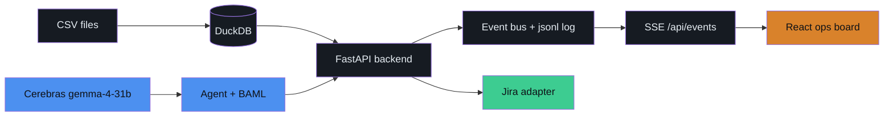
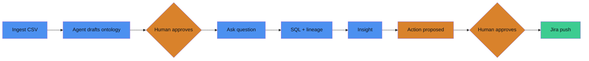

# Foundry-Lite

**A Palantir-Foundry-inspired live ops board: an agent drafts your semantic layer, a human approves every commitment, and insights become Jira actions — with full lineage at every hop.**

Built for the EPAM "Being AI-Native Hackathon 2026", BIA (Business Intelligence & Analytics) track.

## The Problem

Business teams drown in raw CSVs and warehouse tables with no shared semantic layer. BI answers are black boxes — no lineage, no trust. Insights die in dashboards instead of becoming actions.

The problem statement demands an AI-native way to:

- Turn raw data into a **governed semantic model**
- Answer business questions **with provenance**
- Close the loop into **action systems** (Jira)
- Keep a **human in control at every commitment point**

## Our Solution

One live ops board. The agent does the work; the human holds the gates.

1. **Ingest** — upload CSVs, they land in DuckDB and appear on the board immediately.
2. **Draft** — the agent introspects the data and drafts its own ontology (objects, joins, metrics) as `PROPOSED` terms. Amber = awaiting a human.
3. **Approve** — draft-then-approve governance. Nothing enters a query until a human approves the terms it references.
4. **Ask** — questions are answered against *approved* definitions, with the generated SQL visible and the lineage path lit up on the graph.
5. **Act** — insights become drafted Jira tickets. Human approves → pushed. Every number is traceable back to a CSV row.

Everything is event-sourced: the UI is a pure function of `GET /api/state` + the SSE stream at `/api/events`. Users can also hand-build — drag object→object to propose a join, hit ⌘K for a metric builder form, or approve-all in one click.

## Architecture



## The Governance Loop



## Component Stack

| Layer | Tech | Why |
|---|---|---|
| Backend | Python 3.13, FastAPI, uv | Async routes + event streaming, fast iteration |
| Frontend | React 19 + TypeScript strict, Vite, Tailwind v4, bun | `@xyflow/react` canvas for the live graph; no `any` anywhere |
| LLM | Cerebras gemma-4-31b (openai-generic client) | Extreme inference speed — the board animates in real time |
| Schema-locking | BAML (`baml-py`) | Schema-Aligned Parsing; no unvalidated LLM dict ever reaches state |
| Database | DuckDB | Zero-ops analytical SQL directly over CSVs |
| Transport | SSE (`sse-starlette`) + event-sourced jsonl log | UI is a pure function of state + events; log doubles as replay |

## Bring It Up

Prerequisites: [uv](https://docs.astral.sh/uv/), [bun](https://bun.sh/) >= 1.2, Python 3.13.

1. Copy the env template and put your Cerebras key in it (`.env` is gitignored):

   ```bash
   cp .env.example .env   # then set CEREBRAS_API_KEY=<your key>
   ```

   Only `CEREBRAS_API_KEY` is required. The `JIRA_*` and `SLACK_WEBHOOK_URL`
   entries are optional: leave them blank and the action adapter runs in **mock
   mode**, logging a warning and returning a fake `mock.jira.local` URL instead
   of creating a real ticket (`backend/app/actions.py`).

2. Backend:

   ```bash
   uv sync
   uv run uvicorn backend.app.main:app --reload --port 8400
   ```

3. Frontend (proxies `/api` → `:8400`):

   ```bash
   cd frontend && bun install && bun run dev
   ```

4. Seed demo data:

   ```bash
   uv run python -m backend.app.seed
   ```

5. Open http://localhost:5173 — a green status dot means SSE is connected.

Reset to a clean slate anytime: `POST /api/demo/reset` (or the Reset button in the topbar).

### Test it

```bash
uv run pytest                          # backend
cd frontend && bun test && bunx tsc -b # frontend
```

`tsc -b` (not `tsc --noEmit`) is the real check — `frontend/tsconfig.json` is a
solution-style config, and plain `tsc` ignores project references and silently
compiles nothing.

### Demo scenarios

The agent never sees a hardcoded schema — it introspects whatever tables exist
and drafts an ontology from them. So swapping the demo domain is a data change,
not a code change:

| Scenario | Tables | Planted anomaly | Ask |
|---|---|---|---|
| `retail` (default) | customers, orders, tickets | ticket volume ~3x, SLA breach 10% → 40% | "Why did support tickets spike recently?" |
| `supply` | suppliers, shipments, delays | one supplier's late rate 12% → 65% | "Which supplier is driving our late deliveries?" |
| `fintech` | accounts, transactions, chargebacks | mobile_wallet chargebacks 0.9% → 11% | "Which payment channel is driving chargebacks?" |

```bash
uv run python -m backend.app.seed --scenario supply   # from the CLI
curl -X POST localhost:8400/api/demo/reset -d '{"scenario":"fintech"}' \
     -H 'content-type: application/json'              # or live, mid-demo
```

`GET /api/scenarios` lists them. Switching drops the previous scenario's tables
and CSVs and rebuilds the ontology around the new ones, so the agent is never
looking at a schema that is no longer loaded.

Supply and fintech hide their anomaly inside a single segment — one supplier,
one payment channel. Measured across the whole table they look like noise
(supply reads 14% vs 12%); the spike only appears once the agent groups by the
right dimension, which is the point.

### No API key? Replay the demo

`POST /api/replay` (or the Replay button / ⌘K) replays `backend/data/demo_events.jsonl` onto the live event bus — the entire board runs identically with zero LLM calls.

## Key Design Decisions

- **Event-sourced UI** — the board is a pure function of `(GET /api/state, SSE /api/events)`; every event is also appended to `events.jsonl`, which doubles as demo insurance.
- **BAML schema-aligned parsing** — every LLM call goes through generated, typed BAML functions; parse failure emits an `error` event and ends the run. No unvalidated LLM output ever reaches the event bus or `ontology.yaml`.
- **Edges point WITH data flow** — source → object → metric → insight → action, left to right on the board; lineage highlighting follows the same orientation.
- **Every commitment is human-gated** — ontology terms and actions stay `proposed` until a human approves; only approved definitions are used to answer questions.

## Repo Layout

```
backend/app/       # FastAPI routes, event bus, ontology, agents, Jira adapter, seed
backend/data/      # committed: CSVs, ontology.yaml, ontology.baseline.yaml, demo_events.jsonl
                   # generated: foundry.duckdb, events.jsonl (gitignored; seed/bus create them)
baml_src/          # BAML function + output class definitions
baml_client/       # generated BAML client (committed)
frontend/src/      # React board (Vite + TS strict + Tailwind + @xyflow/react)
docs/              # contracts.md (source of truth), DEMO.md (runbook)
tests/             # backend pytest suite
```

`ontology.yaml` is both committed and mutated at runtime (drafting and approval
write to it), so it will show as modified after any demo run — that is expected.
`ontology.baseline.yaml` is the pristine copy that Reset and Replay restore from;
deleting it as a "duplicate fixture" breaks both.
