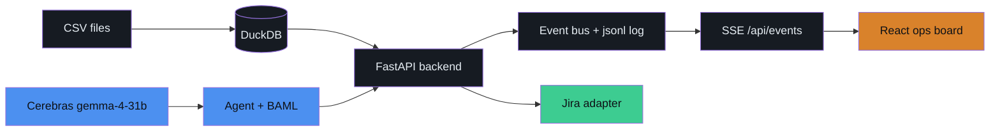
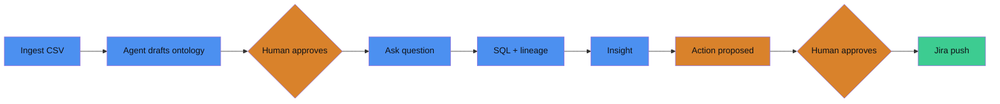

# Foundry-Lite

**A Palantir-Foundry-inspired live ops board: an agent drafts your semantic layer, a human approves every commitment, and insights become Jira actions — with full lineage at every hop.**

Built for the EPAM "Being AI-Native Hackathon 2026", BIA (Business Intelligence & Analytics) track.

## The Problem

Business teams drown in raw CSVs and warehouse tables with no shared semantic layer. BI answers are black boxes — no lineage, no trust. Insights die in dashboards instead of becoming actions.

The problem statement demands an AI-native way to:

- Turn raw data into a **governed semantic model**
- Answer business questions **with provenance**
- Close the loop into **action systems** (Jira)
- Keep a **human in control at every commitment point**

## Our Solution

One live ops board. The agent does the work; the human holds the gates.

1. **Ingest** — upload CSVs, they land in DuckDB and appear on the board immediately.
2. **Draft** — the agent introspects the data and drafts its own ontology (objects, joins, metrics) as `PROPOSED` terms. Amber = awaiting a human.
3. **Approve** — draft-then-approve governance. Nothing enters a query until a human approves the terms it references.
4. **Ask** — questions are answered against *approved* definitions, with the generated SQL visible and the lineage path lit up on the graph.
5. **Act** — insights become drafted Jira tickets. Human approves → pushed. Every number is traceable back to a CSV row.

Everything is event-sourced: the UI is a pure function of `GET /api/state` + the SSE stream at `/api/events`. Users can also hand-build — drag object→object to propose a join, hit ⌘K for a metric builder form, or approve-all in one click.

## Architecture



## The Governance Loop



## Component Stack

| Layer | Tech | Why |
|---|---|---|
| Backend | Python 3.13, FastAPI, uv | Async routes + event streaming, fast iteration |
| Frontend | React 19 + TypeScript strict, Vite, Tailwind v4, bun | `@xyflow/react` canvas for the live graph; no `any` anywhere |
| LLM | Cerebras gemma-4-31b (openai-generic client) | Extreme inference speed — the board animates in real time |
| Schema-locking | BAML (`baml-py`) | Schema-Aligned Parsing; no unvalidated LLM dict ever reaches state |
| Database | DuckDB | Zero-ops analytical SQL directly over CSVs |
| Transport | SSE (`sse-starlette`) + event-sourced jsonl log | UI is a pure function of state + events; log doubles as replay |

## Bring It Up

Prerequisites: [uv](https://docs.astral.sh/uv/), [bun](https://bun.sh/), Python 3.13.

1. Put your Cerebras key in a `.env` at the repo root (gitignored):

   ```
   CEREBRAS_API_KEY=<your key>
   ```

2. Backend:

   ```bash
   uv sync
   uv run uvicorn backend.app.main:app --reload --port 8400
   ```

3. Frontend (proxies `/api` → `:8400`):

   ```bash
   cd frontend && bun install && bun run dev
   ```

4. Seed demo data:

   ```bash
   uv run python -m backend.app.seed
   ```

5. Open http://localhost:5173 — a green status dot means SSE is connected.

Reset to a clean slate anytime: `POST /api/demo/reset` (or the Reset button in the topbar).

### Test it

```bash
uv run pytest                                  # backend
cd frontend && bun test && bunx tsc --noEmit   # frontend
```

### No API key? Replay the demo

`POST /api/replay` (or the Replay button / ⌘K) replays `backend/data/demo_events.jsonl` onto the live event bus — the entire board runs identically with zero LLM calls.

## Key Design Decisions

- **Event-sourced UI** — the board is a pure function of `(GET /api/state, SSE /api/events)`; every event is also appended to `events.jsonl`, which doubles as demo insurance.
- **BAML schema-aligned parsing** — every LLM call goes through generated, typed BAML functions; parse failure emits an `error` event and ends the run. No unvalidated LLM output ever reaches the event bus or `ontology.yaml`.
- **Edges point WITH data flow** — source → object → metric → insight → action, left to right on the board; lineage highlighting follows the same orientation.
- **Every commitment is human-gated** — ontology terms and actions stay `proposed` until a human approves; only approved definitions are used to answer questions.

## Repo Layout

```
backend/app/       # FastAPI routes, event bus, ontology, agents, Jira adapter, seed
backend/data/      # CSVs, foundry.duckdb, ontology.yaml, events.jsonl, demo_events.jsonl
baml_src/          # BAML function + output class definitions
baml_client/       # generated BAML client (committed)
frontend/src/      # React board (Vite + TS strict + Tailwind + @xyflow/react)
docs/              # contracts.md (source of truth), DEMO.md (runbook)
tests/             # backend pytest suite
```
