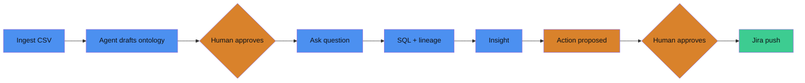
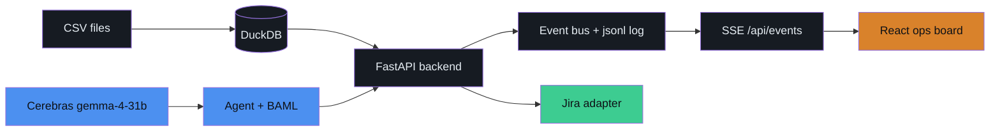

# Foundry-Lite

> An agent drafts your semantic layer, a human approves every commitment, and insights become Jira actions — with full lineage at every hop.

A Palantir-Foundry-inspired live ops board. Built for the EPAM *Being AI-Native Hackathon 2026*, BIA (Business Intelligence & Analytics) track.

- **Live demo video:** [`video/out/demo.mp4`](video/out/demo.mp4) (render it yourself — see [Demo video](#demo-video))
- **One-command prod image:** `docker run -p 8400:8400 ghcr.io/sithtsar/hackbia:latest`

---

## Contents

1. [Quickstart](#quickstart) — up in 60 seconds
2. [What it does](#what-it-does)
3. [Run it (development)](#run-it-development)
4. [Run it (production)](#run-it-production)
5. [Test it](#test-it)
6. [Demo scenarios](#demo-scenarios)
7. [No API key? Replay](#no-api-key-replay)
8. [Troubleshooting FAQ](#troubleshooting-faq)
9. [Architecture](#architecture)
10. [Design decisions](#design-decisions)
11. [Repo layout](#repo-layout)
12. [Demo video](#demo-video)

---

## Quickstart

**Prereqs:** [uv](https://docs.astral.sh/uv/), [bun](https://bun.sh/) ≥ 1.2, Python 3.13.

```bash
cp .env.example .env          # set CEREBRAS_API_KEY=<your key> (only this is required)

uv sync                       # backend deps
uv run python -m backend.app.seed          # seed the demo warehouse
uv run uvicorn backend.app.main:app --reload --port 8400 &   # API on :8400

cd frontend && bun install && bun run dev  # board on :5173, proxies /api → :8400
```

Open **http://localhost:5173**. A **green status dot** = SSE connected. No key? See [Replay](#no-api-key-replay).

---

## What it does

Raw CSVs have no shared semantic layer, BI answers are black boxes with no lineage, and insights die in dashboards. Foundry-Lite is one board where the agent does the work and the human holds the gates:

| Step | What happens |
|---|---|
| **1. Ingest** | Upload CSVs → they land in DuckDB and appear on the board. |
| **2. Draft** | The agent introspects the data and drafts an ontology (objects, joins, metrics) as `PROPOSED`. Amber = awaiting a human. |
| **3. Approve** | Nothing enters a query until a human approves the terms it uses. |
| **4. Ask** | Questions run against *approved* definitions only, with the generated SQL shown and the lineage path lit on the graph. |
| **5. Act** | Insights become drafted Jira tickets. Human approves → pushed. Every number traces back to a CSV row. |

The board is a pure function of `GET /api/state` + the SSE stream at `/api/events`. You can also hand-build: drag object→object to propose a join, hit ⌘K for a metric form, or approve-all in one click.



---

## Run it (development)

Two processes: FastAPI on `:8400`, Vite on `:5173` proxying `/api` → `:8400`.

```bash
# 1. env — .env is gitignored
cp .env.example .env          # set CEREBRAS_API_KEY

# 2. backend
uv sync
uv run python -m backend.app.seed          # seed DuckDB (retail scenario)
uv run uvicorn backend.app.main:app --reload --port 8400

# 3. frontend (new terminal)
cd frontend && bun install && bun run dev
```

`.env` — only `CEREBRAS_API_KEY` is required. `JIRA_*` and `SLACK_WEBHOOK_URL` are optional: leave them blank and the action adapter runs in **mock mode**, logging a warning and returning a fake `mock.jira.local` URL instead of creating a real ticket (`backend/app/actions.py`).

Reset to a clean slate anytime: the **Reset** button, or `POST /api/demo/reset`.

---

## Run it (production)

One container. The API process also serves the built board — no proxy, no CORS, no split deploy.

```bash
docker run -p 8400:8400 -e CEREBRAS_API_KEY=<your key> ghcr.io/sithtsar/hackbia:latest
```

Open **http://localhost:8400** — same origin serves both `/api/*` and the board. DuckDB seeds on boot (~1s, idempotent), so a fresh container is demo-ready.

Build it yourself:

```bash
docker build -t foundry-lite .
docker run -p 8400:8400 -e CEREBRAS_API_KEY=<your key> foundry-lite
```

The image is published to GHCR on every push to `main`, and CI smoke-tests the pushed image by digest — booting it and asserting it answers on both `/api/state` and `/`.

---

## Test it

```bash
uv run pytest                    # backend (97 tests)

cd frontend
bun test                         # frontend unit tests
bun run build                    # runs `tsc -b` then vite build
```

> **Use `tsc -b`, not `tsc --noEmit`.** `frontend/tsconfig.json` is solution-style (project references only); plain `tsc` ignores the references and silently checks nothing. `bun run build` and the Docker build both use `tsc -b`.

---

## Demo scenarios

The agent never sees a hardcoded schema — it introspects whatever tables exist and drafts an ontology from them. Swapping the demo domain is a **data** change, not a code change:

| Scenario | Tables | Ask |
|---|---|---|
| `retail` *(default)* | customers, orders, tickets | *"Why did support tickets spike recently?"* |
| `supply` | suppliers, shipments, delays | *"Which supplier is driving our late deliveries?"* |
| `fintech` | accounts, transactions, chargebacks | *"Which payment channel is driving chargebacks?"* |

```bash
uv run python -m backend.app.seed --scenario supply     # from the CLI
curl -X POST localhost:8400/api/demo/reset \
     -H 'content-type: application/json' \
     -d '{"scenario":"fintech"}'                          # or live, mid-demo
```

`GET /api/scenarios` lists them. Switching drops the previous scenario's tables and CSVs and rebuilds the ontology, so the agent never sees a schema that is no longer loaded.

Each scenario seeds a rate anomaly hidden inside one segment — a single supplier, a single payment channel — so a whole-table average looks like noise and the signal only appears once you group by the right dimension. The agent surfaces a real, SQL-grounded rate driver on its own (e.g. supply names the highest late-delivery *rate*, fintech the highest chargeback *rate*), with the SQL and lineage both visible. Steering it onto one specific planted segment every time is prompt work in `backend/app/agents.py`, not a code guarantee.

---

## No API key? Replay

`POST /api/replay` (or the **Replay** button / ⌘K) replays `backend/data/demo_events.jsonl` onto the live event bus. The **entire retail board runs identically with zero LLM calls** — ontology, ask, insight, and action all fire deterministically. Approvals are still done live, so the human-gate demo still happens.

> Replay only exists for `retail`. Supply and fintech need a live agent (or narrate over the recorded footage in `video/raw/`).

---

## Troubleshooting FAQ

| Symptom | Cause | Fix |
|---|---|---|
| **Status dot is red / board never populates** | Backend not up, or frontend can't reach `/api`. | Confirm `curl localhost:8400/api/state` returns JSON. In dev, the board must be on `:5173` (Vite proxy), not opened as a file. |
| **Port already in use** | A previous run didn't exit. | `lsof -ti:8400 \| xargs kill` (or `:5173`). |
| **Types "pass" but a real error exists** | Plain `tsc --noEmit` on a solution-style config checks nothing. | Use `tsc -b` (or `bun run build`). |
| **Queries return nothing / empty graph** | DuckDB isn't seeded (fresh clone or fresh container). | `uv run python -m backend.app.seed`. The Docker image seeds on boot. |
| **`ontology.yaml` shows as modified in git** | Expected — drafting and approval write to it at runtime. | `git checkout -- backend/data/ontology.yaml` to reset. Reset/Replay restore from `ontology.baseline.yaml` (don't delete it). |
| **LLM stalls / Cerebras is down** | Upstream latency or outage. | Retail: click **Replay** for a zero-LLM run. Supply/fintech: narrate over `video/raw/*.webm`. |
| **Action "pushed" but no Jira ticket** | `JIRA_*` unset → mock mode. | Expected; check logs for the `mock.jira.local` URL. Set `JIRA_*` in `.env` for real tickets. |
| **Board looks stale / stuck mid-approval** | Two scenarios' state mixed on screen. | Click **Reset**, wait for the `status` toast, restart. |

More live-demo contingencies: [`docs/DEMO.md`](docs/DEMO.md).

---

## Architecture



**No MCP, no skills, no hooks, no autonomous tool-calling loop** — deliberately. The contract demands an exact, deterministic event sequence (lineage traversal, threshold rules, approval gating), which is cleaner to emit from plain Python than to coax out of an agent loop. The LLM is used for exactly four narrow, schema-locked steps.

| Layer | Tech | Why |
|---|---|---|
| Backend | Python 3.13, FastAPI, uv | Async routes + event streaming |
| Frontend | React 19 + TS (strict), Vite, Tailwind v4, bun | `@xyflow/react` live graph; no `any` |
| LLM | Cerebras gemma-4-31b (openai-generic) | Extreme inference speed — the board animates in real time |
| Schema-locking | BAML (`baml-py`) | Schema-Aligned Parsing; no unvalidated LLM dict reaches state |
| Database | DuckDB | Zero-ops analytical SQL directly over CSVs |
| Transport | SSE (`sse-starlette`) + jsonl event log | UI is a pure function of state + events; log doubles as replay |

---

## Design decisions

- **Event-sourced UI** — the board is a pure function of `(GET /api/state, SSE /api/events)`. Every event is also appended to `events.jsonl`, which doubles as demo insurance (replay).
- **BAML schema-aligned parsing** — every LLM call goes through generated, typed BAML functions with a two-retry policy. Parse failure emits an `error` event and ends the run. No unvalidated LLM output ever reaches the event bus or `ontology.yaml`.
- **Joins are measured, not guessed** — `x_id → table x`, confirmed by ≥90% distinct-value containment in DuckDB. No LLM involved; confidence = the containment ratio.
- **Every SQL is guarded then validated** — `SELECT`/`WITH` only, single statement, DDL/DML denylist, then `EXPLAIN` against DuckDB. On failure the error is fed back for exactly one retry. Invalid SQL never executes.
- **Edges point WITH data flow** — source → object → metric → insight → action, left to right; lineage highlighting follows the same orientation.
- **Every commitment is human-gated** — ontology terms and actions stay `proposed` until a human approves; approved terms are never overwritten by a later draft, and `ontology.yaml` is written atomically (tempfile + `os.replace`).

---

## Repo layout

```
backend/app/       FastAPI routes, event bus, ontology, agents, Jira adapter, seed
backend/data/      committed:  CSVs, ontology.yaml, ontology.baseline.yaml, demo_events.jsonl
                   generated:  foundry.duckdb, events.jsonl  (gitignored)
baml_src/          BAML function + output-class definitions
baml_client/       generated BAML client (committed)
frontend/src/      React board (Vite + TS strict + Tailwind + @xyflow/react)
video/             Remotion demo-video pipeline + Playwright capture harness
docs/              contracts.md (source of truth), DEMO.md (live runbook)
tests/             backend pytest suite
Dockerfile         single-container prod image (board served by the API)
```

> `ontology.yaml` is both committed **and** mutated at runtime, so it shows as modified after any demo run — expected. `ontology.baseline.yaml` is the pristine copy that Reset and Replay restore from; deleting it breaks both.

---

## Demo video

A 141s walkthrough — architecture explainer, then the board reacting live across all three scenarios — built with [Remotion](https://remotion.dev) from real Playwright captures of the running board.

```bash
cd video && bun install
bun run check:captions                              # verify caption timings vs the captures
bunx remotion render src/index.ts DemoVideo out/demo.mp4
```

The rendered `out/demo.mp4` and the raw `raw/*.webm` captures are gitignored (large binaries). Re-capture footage against a running board with `frontend/capture.mjs`. Full pipeline docs: [`video/README.md`](video/README.md).
